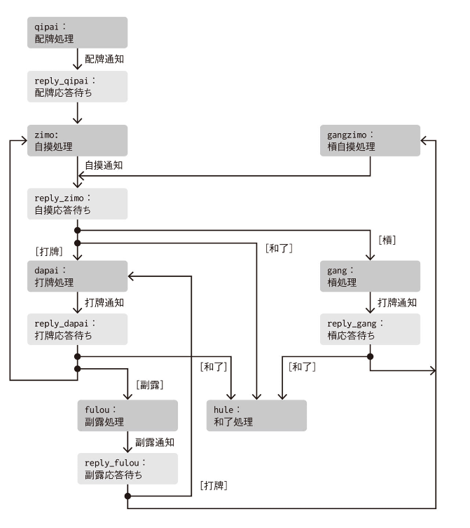
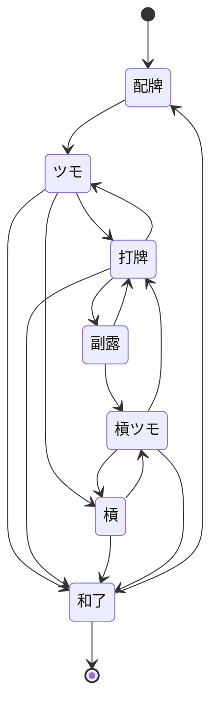
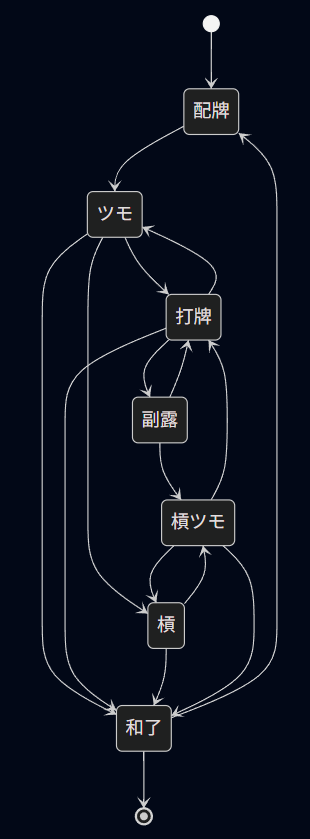

# ゲームフロー

```mermaid
stateDiagram-v2
    %% 全ての状態のentryに処理と通知がある
    %% ある状態にいるときは応答を待っている
    %% 通知は全員に送る
    %% 対局開始
    [*] --> 配牌
    %% 配牌の応答は待つが、とくにアクションはないはず
    %% 応答が完了したら親からツモっていく
    配牌 --> ツモ
    %% ツモったプレイヤーの応答を待つ
    ツモ --> 打牌
    ツモ --> 槓
    ツモ --> 和了
    %% 打牌したプレイヤー以外の応答を待つ
    %% 全員特に何も無ければ次のプレイヤーがツモる
    打牌 --> ツモ
    %% 和了>ポン>チーなので全員の応答を待ってから遷移する
    打牌 --> 副露
    打牌 --> 和了
    %% 打牌に対する副露なのでポン・チー・大明槓
    %% 大明槓以外なら打牌応答を待つ
    副露 --> 打牌
    %% 大明槓なら槓ツモまで行って通知する
    副露 --> 槓ツモ
    %% ツモに対する暗槓・加槓 槍槓があるので一度通知する
    槓 --> 槓ツモ
    槓 --> 和了
    槓ツモ --> 打牌
    槓ツモ --> 槓
    槓ツモ --> 和了
    %% 対局続行なら局の開始に戻る
    和了 --> 配牌
    %% 対局終了
    和了 --> [*]
```

局開始通知&配牌という感じか